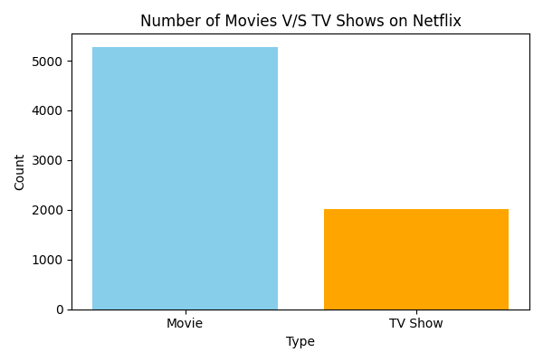
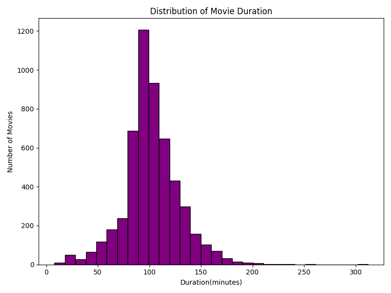
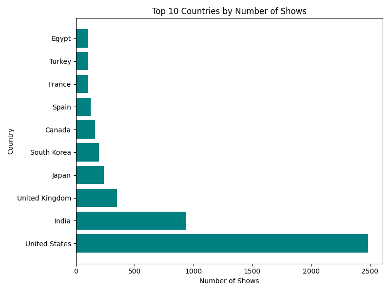
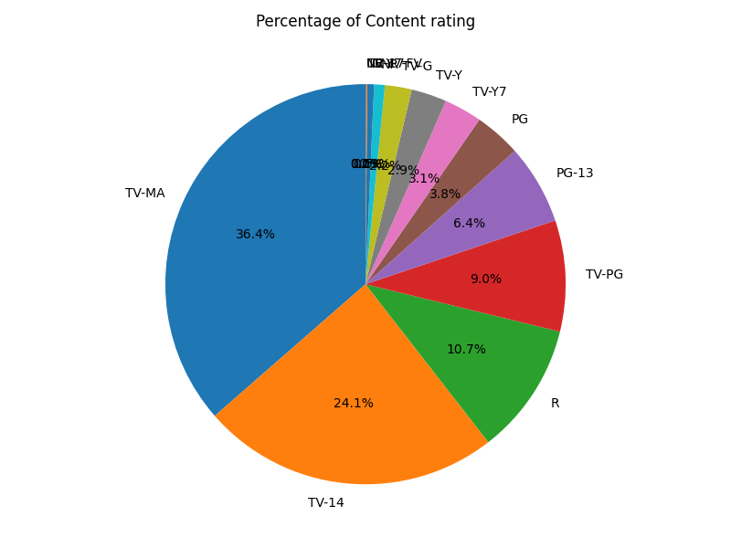
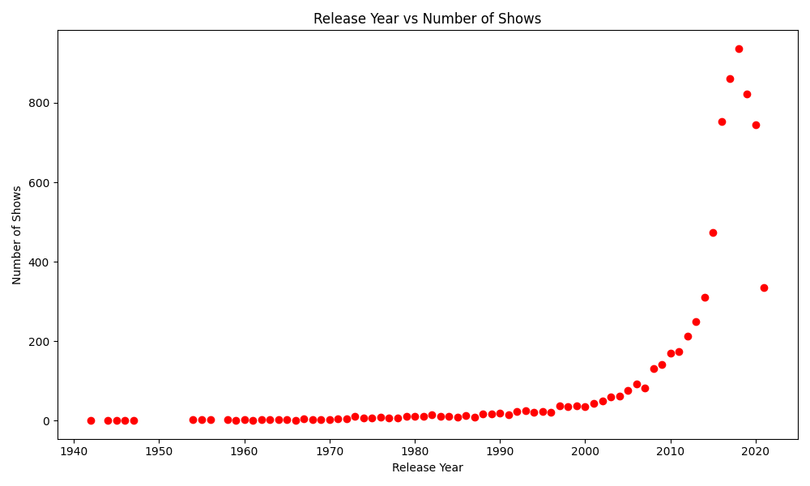

# 🎬 Netflix dataset project

## 📌 Project Description

This project focuses on analyzing the Netflix dataset to gain insights into content distribution, trends, and patterns. Using Python libraries, various visualizations were created to better understand movies and TV shows available on Netflix.

---

## 🛠️ Tools & Technologies Used

* Python
* Pandas
* Matplotlib

---

## 📊 Visualizations

### 🎥 Movies vs TV Shows

### 📈 Movie Duration Distribution

### 🌍 Top 10 Countries Producing Content

### 🎭 Content Ratings Distribution

### 📅 Release Year Trends

---

## 🔍 Key Insights

* Movies are more in number compared to TV Shows on Netflix
* Most content is produced by a few dominant countries
* Content production increased significantly after 2015
* Majority of movies fall within a specific duration range
* Certain content ratings are more common than others

---

## 📁 Dataset

* Dataset used: `netflix_titles.csv`

---

## 🚀 Conclusion

This project demonstrates how data analysis and visualization can help uncover meaningful insights from real-world datasets.

---

## 📌 Author

Mahak Kanwar
